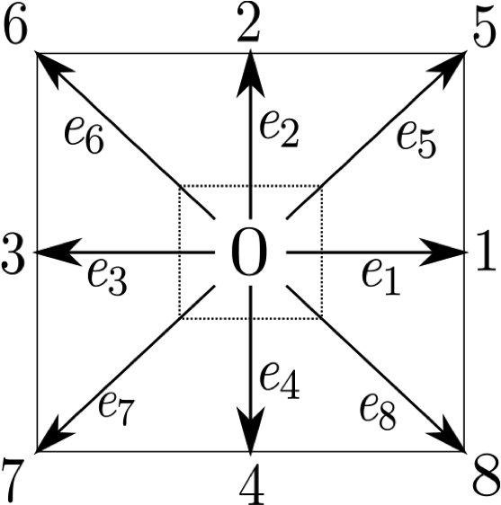

# Introduzione
La fluidodinamica computazionale (CFD) e' un campo della meccanica dei fluidi che impiega metodi
numerici e computazionali, per analizzare e risolvere problemi che riguardano il flusso di fluidi. 
In questa relazione di laboratorio si discutera' dello sviluppo di un simulatore (o *solver*) di
fluidi in due dimensioni. In particolare, un solver e' un software che utilizza le tecniche della
fluidodinamica computazionale, per simulare il flusso di fluidi (liquidi o gas) e la loro interazione
con le superfici. Verranno discusse due implementazioni del solver: un sequenziale (per cui non
vengono sfruttate tecniche e supporti hardware alla parallelizzazione) e una parallela su GPU
(implementata utilizzando CUDA).
Nella sezione 1 verra' discusso brevemente il metodo che verra' utilizzato per simulare i fluidi,
mentre nella sezione 2 verranno discussi i dettagli implementativi (strutture dati e algoritmi)
della versione sequenziale del solver. Nella sezione 3 si esaminera' l'implementazione parallela
sulla piattaforma CUDA, per cui verranno proposti anche alcuni miglioramenti possibili per eventuali
sviluppi futuri. Infine, nella sezione 4 verranno messe a confronto le due versioni esaminando i
diversi benchmarks eseguiti.

# Il Metodo Reticolare di Boltzmann 
Quando di parla di fluidodinamica computazionale e' impossibile non parlare anche delle equazioni di
Navier Stokes. Esse sono un insieme di equazioni parziali differenziali che descrivono il moto dei
fluidi nel tempo. Tipicamente il compito dei solver e' quello di ottenere un'approssimazione delle
soluzioni di queste equazioni per mezzo di metodi numerici appositi.
In linea di principio generale, il compito di un solver e' il seguente: dato lo stato di un fluido
descritto in termini della sua densita' macroscopica $\rho$ e della sua velocita' macroscopica
$\vec{u}$, calcola per lo stato risultante al tempo $t+\Delta t$, dove $\Delta t$ e' il passo.
Nella fluidodinamica computazionale esistono diversi metodi e tecniche impiegate per il calcolo di
queste soluzioni approssimate, ma proprio per la natura delle equazioni parziali differenziali,
molti di questi risultano molto dispendiosi in termini di risorse computazionali. Il metodo alla
base del solver che e' stato scelto, invece, rappresenta un'approccio alternativo, basato sugli
automi cellulari anziche' sulla soluzione delle equazioni di Navier Stokes. La motivazione
principale della scelta e' che per natura risulta particolarmente indicato per sfruttare
architetture multicore massive senza la necessita' di dover modificare radicalmente
l'implementazione sequenziale.
Come il nome suggerisce, questo metodo fu derivato originariamente dalla teoria cinetica dei gas di
Ludwig Boltzmann, secondo la quale i fluidi/gas possono essere immaginati come un grande numero di
particelle che si muovono secondo moti apparentemente casuali. L'idea fondamentale del metodo
reticolare di Boltzmann e' quella di discretizzare lo spazio nel quale queste particelle si muovono,
confinandole ai nodi di un *reticolo*.
Generalmente, in uno spazio a due dimensioni le possibili direzioni di una particella sono 9
(inclusa la possibilita' di rimanere stazionaria). Tale modello e' chiamato anche comunemente
modello `D2Q9`\footnote{Naturalmente esistono altri modelli, quali il D3Q19}.

{ width=20% }

E' possibile rappresentare le possibili direzioni mediante 9 vettori a due componenti ($x$ e $y$)
$\vec{e_i}$, definiti come:
$$
\vec{e_i} = 
\begin{cases}
    (0, 0)&i = 0 \\
    (1, 0), (0, 1), (-1, 0), (0, -1)&i = 1,..4\\ 
    (1, 1), (-1, 1), (-1, -1), (1, -1)&i = 5,.. 8\\
\end{cases}
$$
Per modellare la presenza di fluido in ognuna delle direzioni, si definisce una funzione di
distribuzione di probabilita' $f_i(\vec{x}, \vec{e_i}, t)$, che indica la densita' di fluido alla
posizione $\vec{x}$, con direzione $\vec{e_i}$, al tempo $t$.

# Implementazione Sequenziale 
In questa sezione verra' discussa l'implementazione sequenziale in cui verranno anche illustrate
ottimizzazioni a livello di compilazione (`O3`)
$$
stream \rightarrow collide \rightarrow bounce
$$
\begin{algorithm}
	\caption{LBM - Streaming Step}
	\begin{algorithmic}
		\For {$x=0$ to $width$}
		  \For {$y=0$ to $height$}
				\State 
        \State Compute streaming step $l \rightarrow l_t$
        \State Swap $l$ with $l_t$
			\EndFor
		\EndFor
	\end{algorithmic} 
\end{algorithm}

# Implementazione Parallela su GPU 
In questa sezione verra' discussa l'implementazione su GPU

# Risultati e benchmarks
In questa sezione verranno discussi gli esperimenti/benchmarks della versione sequenziale e
parallela. Inoltre verranno esposti i grafici dello speedup.   

# Conclusioni
In questa sezione verranno messe le conclusioni tratte dagli esperimenti 
