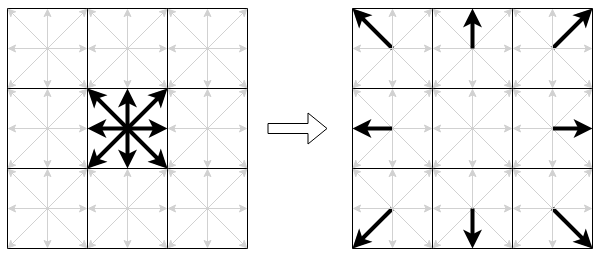
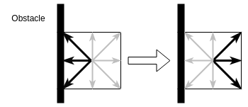

# Introduzione
In questa relazione di laboratorio si discutera' dello sviluppo di un simulatore
(o *solver*) di fluidi in due dimensioni. Un solver e' un software che sfrutta i
metodi della fluidodinamica computazionale per simulare il flusso di fluidi
(liquidi o gas), e la loro interazione con le superfici. Verranno discusse due
implementazioni del solver: una sequenziale e una parallela su GPU (implementata
utilizzando CUDA). Nella sezione 1 verra' discusso il metodo impiegato per la
simulazione di fluidi, da cui ne deriva naturalmente anche la versione
sequenziale del solver (discussa invece brevemente nella sezione 2). Nella
sezione 3 si esaminera' l'implementazione parallela sulla piattaforma CUDA, per
cui verranno proposti anche alcuni miglioramenti possibili per eventuali
sviluppi futuri. Infine, nella sezione 4 verranno messe a confronto le due
versioni, esaminando i diversi benchmarks eseguiti.

# Il Metodo Reticolare di Boltzmann
Quando di parla di fluidodinamica computazionale, e' impossibile non parlare
anche delle equazioni di Navier Stokes: un insieme di equazioni parziali
differenziali che descrivono il moto dei fluidi nel tempo. Simulare un fluido
richiede essenzialmente di ottenere delle soluzioni (anche approssimate) di queste
equazioni, spesso discretizzate.
Da questo punto di vista, simulare un fluido richiede di calcolare ad ogni passo
$t$ lo stato successivo al tempo $t + \Delta t$, in cui lo stato del fluido e'
descritto in termini di due quantita': la sua *densita' macroscopica* ($\rho$) e
la sua *velocita' macroscopica* ($\vec{u}$).
Nella fluidodinamica computazionale esistono diversi metodi e tecniche che
possono essere impiegate per ottenere un'approssimazione di queste soluzioni, ma
proprio per la natura delle equazioni parziali differenziali, molti di questi
risultano molto dispendiosi in termini di risorse computazionali. Il metodo alla
base del solver che e' stato scelto, invece, rappresenta un'approccio
alternativo, basato sugli automi cellulari anziche' sulla soluzione delle
equazioni di Navier Stokes. La motivazione principale della scelta e' che per
natura risulta particolarmente indicato per sfruttare architetture multicore
massive senza la necessita' di dover modificare radicalmente l'implementazione
sequenziale. Il metodo pone le sue basi nella teoria cinetica dei gas di Ludwig
Boltzmann, secondo la quale i fluidi/gas possono essere immaginati come un
grande numero di particelle che si muovono secondo moti apparentemente casuali.
L'idea fondamentale del metodo reticolare di Boltzmann e' quella di
discretizzare lo spazio nel quale queste particelle si muovono, confinandole ai
nodi di un *reticolo*. In generale, in uno spazio a due dimensioni, le
particelle all'interno di un nodo sono limitate a muoversi in 9 possibili
direzioni (inclusa la possibilita' di rimanere stazionarie). Questo modello
descritto a 2 dimensioni e a 9 direzioni possibili e' anche chiamato comunemente
modello `D2Q9` \footnote{Naturalmente esistono altri modelli quali il D3Q19,
che rappresenta uno spazio a 3 dimensioni con 19 possibili direzioni}.

{ width=20% }

Le possibili direzioni sono rappresentate matematicamente mediante 9 vettori
$\vec{e_i}, i=0,\dots,8$ a due componenti ($x$, $y$), definiti come:
$$
\vec{e_i} =
\begin{cases}
    \langle0, 0\rangle &i = 0 \\
    \langle1, 0\rangle, \langle0, 1\rangle, \langle-1, 0\rangle, \langle0,
    -1\rangle &i = 1,..4\\
    \langle1, 1\rangle, \langle-1, 1\rangle, \langle-1, -1\rangle, \langle1,
    -1\rangle&i = 5,.. 8\\
\end{cases}
$$
La densita' macroscopica $\rho$ di un fluido, e' modellata mediante una
funzione di densita' di probabilita' $f(\vec{x}, \vec{e_i}, t)$, che indica la
densita' di fluido alla posizione $\vec{x}$, con direzione $\vec{e_i}$, al tempo
$t$. Come detto precedentemente, quello che si vuole ottenere e' lo stato del
fluido al tempo $t+\Delta t$, cioe' dato il valore di $f(\vec{x}, \vec{e_i},
t)$, trovare il valore di $f(\vec{x}, \vec{e_i}, t+\Delta t)$.
Nel metodo reticolare di Boltzmann il calcolo del nuovo stato e' eseguito per
mezzo di tre passi:

1. **Propagazione**: le particelle di fluido vengono propagate a seconda della loro
   direzione ai nodi adiacenti
2. **Collisione**: le particelle di fluido collidono tra loro, di fatto rimodulando
   la densita' all'interno dei singoli nodi
3. **Rimbalzo**: le particelle di fluido rimbalzano alla collisione con eventuali
   superfici solide

E' dimostrabile matematicamente che questi 3 passaggi rappresentano
un'approssimazione delle equazioni di Navier Stokes.

## Propagazione
Il passo di propagazione consiste essenzialmente nel trasferire la densita' di fluido presente alla
direzione $\vec{e_i}$, di un nodo del reticolo alla posizione $\vec{x}$, alla direzione $\vec{e_i}$
al nodo adiacente corrispondente alla posizione $\vec{x} + \vec{e_i}$. Dal punto di vista del
metodo, il passo e' riassumibile con la seguente equazione:
$$
f(\vec{x} + \vec{e_i}, \vec{e_i}, t + \Delta t) = f(\vec{x}, \vec{e_i}, t)
$$
Il passo e' illustrato anche in Figura \ref{figStreaming}, in cui le frecce piu' spesse indicano il
fluido presente inizialmente nei siti del nodo centrale e la freccia vuota indica il passo di
propagazione.



## Collisione
Il passo di collisione e' leggermente piu' complicato rispetto al passo di
propagazione, poiche' richiede di calcolare il valore della distribuzione di
densita' di equilibrio, data dall'equazione di seguito
$$
f^{eq}(\vec{x}, \vec{e_i}, t) = \rho w_i
[1 + 3\vec{e_i}\cdot \vec{u} + \frac{9}{2}(\vec{e_i} \cdot \vec{u})^2 - \frac{3}{2} |\vec{u}|^2]
$$
In cui $w_i$ indica un peso associato alla direzione *i-esima*. Il peso serve a
modellare il fatto che alcune direzioni siano piu' probabili rispetto ad altre.
Risultati teorici suggeriscono la valorizzazione dei pesi nel modo seguente
$$
w_0 = \frac{4}{9}, \quad w_{1, \dots, 4} = \frac{1}{9} \quad w_{5, \dots, 8} = \frac{1}{36}
$$
$\rho$ e $\vec{u}$ si riferiscono invece alle quantita' macroscopiche del nodo
$\vec{x}$. Tali quantita' possono essere calcolate sostanzialmente facendo una
somma e una media.
$$
\begin{aligned}
\rho(\vec{x}, t) &= \sum^{8}_{i=0} f(\vec{x}, \vec{e_i}, t) \\
\vec{u}(\vec{x}, t) &= \frac{1}{\rho} \sum^{8}_{i=0} f(\vec{x}, \vec{e_i}, t) \cdot \vec{e_i}
\end{aligned}
$$
Una volta ottenuto il valore di $f^{eq}(\vec{x}, \vec{e_i}, t)$ e' possibile
infine calcolare per ogni posizione $\vec{x}$ e direzione $i$ il nuovo
stato\footnote{Per semplicita' di notazione, si impone che $f(\vec{x},
\vec{e_i}, t) = f_i(\vec{x}, t)$ }:
$$
f_i(\vec{x}, t+\Delta t) = f_i(\vec{x}, t) +
\omega [f_i^{eq}(\vec{x}, t) - f_i(\vec{x},t)]
$$
Il termine $\omega$ e' un valore costante, determinato dalla *viscosita'* del
fluido.

### Rimbalzo
Quando le particelle di fluido collidono con una superficie solida, non la
devono attraversare, per cui e' necessario gestire questa condizione in un passo
apposito. Esistono diversi metodi per gestire tale condizione. Per semplicita'
e' stato scelto il metodo di *bounce-back*, descritto graficamente in figura.

{ width=40% }

In sintesi, se in una cella $\vec{x}$ del reticolo e' presente un ostacolo,
allora il fluido viene respinto verso la direzione opposta.

# Implementazione Sequenziale
L'implementazione sequenziale del solver non richiede particolari trattazioni,
siccome l'algoritmo consiste nell'implementazione diretta del metodo descritto.
L'implementazione necessita solo di un'accortezza: dal momento che nel passo di
propagazione e' richiesta la distribuzione di fluido al tempo $t$, e' necessario
introdurre un altro reticolo di *"supporto"* $f'$, corrispondente alla
distribuzione al tempo $t + \Delta t$. In questo modo, si evita di sovrascrivere
valori che sarebbero diversamente richiesti dal passo, un'operazione che
invaliderebbe di fatto la correttezza del metodo. Un singolo passo di
simulazione del solver consiste nell'esecuzione sequenziale dei passi
descritti

\begin{algorithm}
    \caption{Passo di simulazione}
    \begin{algorithmic}
        \State $Collide(f)$
        \State $Stream(f, f')$
        \State $Bounce(f')$
        \State Swap $f$ with $f'$
    \end{algorithmic}
\end{algorithm}

Per implementare l'equazione del passo di collisione, e' necessario calcolare la
nuova densita' in ogni direzione per ogni cella del reticolo

\begin{algorithm}
    \caption{Passo di Collisione}
    \begin{algorithmic}
        \For {$x=0$ to $width$}
            \For {$y=0$ to $height$}
                \State $\vec{x}_{pos} = (x, y)$
                \State Compute $\rho(\vec{x}_{pos})$ and $\vec{u}(\vec{x}_{pos})$
                \For {i = 0 to Q}
                    \State Compute $f^{eq}(\vec{x}_{pos})$ using $\rho$ and
                    $\vec{u}$
                    \State $f_i(\vec{x}_{pos}) \mathrel{+}= \Omega
                    [f^{eq}_i(\vec{x}_{pos}) - f_i(\vec{x}_{pos})]$
                \EndFor
            \EndFor
        \EndFor
    \end{algorithmic}
\end{algorithm}

I cicli piu' esterni servono a scorrere l'intero spazio bidimensionale, in cui
in ogni cella vengono calcolate le quantita' macroscopiche necessarie per il
calcolo di $f^{eq}$. Nel ciclo piu' interno vengono infine calcolate le nuove
densita' associate ad ogni direzione $i$.

\begin{algorithm}
    \caption{Passo di Propagazione}
    \begin{algorithmic}
        \For {$x=0$ to $width$}
            \For {$y=0$ to $height$}
                \For {i = 0 to Q}
                    \State $\vec{x}_{pos} = (x, y)$
                    \State $f'_i(\vec{x}_{pos} + \vec{e}_i) = f_i(\vec{x}_{pos})$
                    \State $f'_i(\vec{x}_{pos} + \vec{e}_i) = f_i(\vec{x}_{pos})$
                    \State $f'_i(\vec{x}_{pos} + \vec{e}_i) = f_i(\vec{x}_{pos})$
                    \State $f'_i(\vec{x}_{pos} + \vec{e}_i) = f_i(\vec{x}_{pos})$
                    \State $f'_i(\vec{x}_{pos} + \vec{e}_i) = f_i(\vec{x}_{pos})$
                    \State $f'_i(\vec{x}_{pos} + \vec{e}_i) = f_i(\vec{x}_{pos})$
                    \State $f'_i(\vec{x}_{pos} + \vec{e}_i) = f_i(\vec{x}_{pos})$
                    \State $f'_i(\vec{x}_{pos} + \vec{e}_i) = f_i(\vec{x}_{pos})$
                \EndFor
            \EndFor
        \EndFor
    \end{algorithmic}
\end{algorithm}

Il passo di propagazione e' molto simile a quello di collisione, e consiste
solamente nel trasferimento delle densita' in ogni direzione nel reticolo di
supporto.
Nel passo di collisione, e' stato deciso di fare l'*unwrap* del loop sulle
direzioni, in modo da eliminare anche operazioni di modulo che avrebbero
diversamente appesantito il programma.

\begin{algorithm}
    \caption{Passo di Collisione}
    \begin{algorithmic}
        \For {$x=1$ to $width$}
            \For {$y=1$ to $height$}
                \State $f'_1(\langle x+1, y \rangle) = f_1(\langle x, y \rangle)$
            \EndFor
        \EndFor
    \end{algorithmic}
\end{algorithm}


Per poter visualizzare la simulazione, lo stato viene poi scritto all'interno di
un file VTK in modo da poter essere usufruito dal software di visualizzazione
Paraview\textsuperscript{\textcopyright}.

## Implementazione del Modello
Il modello `D2Q9` e' implementabile in due modi differenti. Il primo
consiste nel rappresentare il reticolo come una matrice di dimensioni $larghezza
\times altezza$ di nodi di reticolo. Ogni nodo contiene il valore di $f$ in
tutte le 9 direzioni e il valore del vettore a due componenti $\vec{u}$.
```c
typedef Real float;
#define Q 9

typedef struct LatticeNode {
    Real[Q] f;
    Vector2D<Real> u = {0, 0};
} LatticeNode;

LatticeNode[WIDTH][HEIGHT] lattice;
```

Il secondo, invece, consiste nel rappresentare un reticolo come molteplici
matrici.

```c
typedef struct Lattice {
    Real[WIDTH][HEIGHT][Q] f;
    Vector2D<Real> u[WIDTH][HEIGHT];
}

Lattice lattice;
```

Sebbene i due metodi siano semanticamente equivalenti, la scelta di
un'implementazione rispetto all'altra puo' influenzare gli accessi in memoria,
con conseguente influenza delle performance significativa. Nell'implementazione
e' stato deciso di utilizzare la seconda rappresentazione tre motivi principali.
Il primo e' in termini di utilizzo della memoria poiche' il compilatore, se si
scegliesse la prima rappresentazione, potrebbe inserire un *padding* in ogni
struttura, che sara' a sua volta replicata piu' volte all'interno di un array,
con un conseguente spreco di memoria. La seconda motivazione e' che ogni volta
che si accede ad un nodo, non sempre ci si serve di tutti i suoi campi
(propagazione e collisione utilizzano solo la densita'), per cui se si
scegliesse la prima implementazione, ne risulterebbe che ogni volta che si deve
accedere ad un campo di un nodo, sia necessario leggere l'intera struttura dalla
memoria, anche se i rimanenti campi non sono necessari.
Infine, la seconda rappresentazione e' anche particolarmente adatta ad
implementazioni su GPU, poiche' favorisce l'accesso *coalescente* dei threads
alla memoria.

# Implementazione Parallela
Per la parallelizzazione del solver, si e' seguita la metodologia descritta in
[@9092429]. E' possibile notare come i due loop piu' esterni di ogni metodo
servano essenzialmente a mappare l'intero spazio della simulazione, per cui
evidenziano come la computazione sia di tipo data parallel *globally
synchronous*. Per questa ragione, e' stato deciso di implementare il solver
parallelo su piattaforma CUDA, poiche' si presta particolarmente bene a questo
tipo di computazioni.

Per poter sincronizzare tutti i thread blocks tra di loro, i 3 sotto-passi di
simulazione sono stati implementati come CUDA kernels. Il passo di simulazione,
quindi, consistera' semplicemente in una chiamata ripetuta dei kernels in
sequenza e di una successiva sincronizzazione a livello di device. Alla fine dei
sotto-passi, si trasferiscono i dati del reticolo dal device all'host. Anche in
questo caso, i puntatori dei reticoli $ld$ e $ld$ (allocati sul device) vengono
scambiati tra loro.

\begin{algorithm}
    \caption{Passo di Simulazione Parallelo}
    \begin{algorithmic}
        \State Launch $CollideKernel$ step on $ld$
        \State Synchronize with device
        \State Launch $StreamKernel$ step $ld \rightarrow ld'$
        \State Synchronize with device
        \State Launch $BounceKernel$ step on $ld'$
        \State Transfer memory back to host $ld' \rightarrow l$
        \State Swap $ld$ with $ld'$
    \end{algorithmic}
\end{algorithm}

La parallelizzazione dei singoli passi, invece, consiste nell'eliminazione dei
due cicli for dell'implementazione sequenziale necessari a scorrere l'intero
spazio bidimensionale della simulazione. Grazie al modello di programmazione
scelto, tale parallelizzazione e' molto semplice, per cui basta eliminare i due
cicli `for` e sostituire gli indici con l'indice $x$ e $y$ di thread all'interno
del blocco. Di seguito e' riportato solo il passo di collisione, siccome tutti
gli altri passi sono stati parallelizzati seguendo lo stesso principio

\begin{algorithm}
    \caption{Passo di Collisione Parallelo}
    \begin{algorithmic}
        \State $x = blockIdx.x * blockDim.x + threadIdx.x$
        \State $y = blockIdx.y * blockDim.y + threadIdx.y$
        \State $\vec{x}_{pos} = \langle x, y \rangle$
        \State Compute $\rho(\vec{x}_{pos})$ and $\vec{u}(\vec{x}_{pos})$
        \For {i = 0 to Q}
            \State Compute $f^{eq}(\vec{x}_{pos})$ using $\rho$ and
            $\vec{u}$
            \State $f_i(\vec{x}_{pos}) \mathrel{+}= \Omega
            [f^{eq}_i(\vec{x}_{pos}) - f_i(\vec{x}_{pos})]$
        \EndFor
    \end{algorithmic}
\end{algorithm}

# Risultati e benchmarks


Per poter eliminare ogni interferenza dovuta a tempi di esecuzione sincroni,
ogni test e' stato effettuato evitando di eseguire il passo di scrittura dello
stato all'interno dei files per la visualizzazione. In questo modo, i tempi di
esecuzione comprendono solo i tempi di computazione e di trasferimento in
memoria (nel caso dell'implementazione parallela, anche dei tempi di
trasferimento dati *device-host*).

# Conclusioni
In questa sezione verranno messe le conclusioni tratte dagli esperimenti

